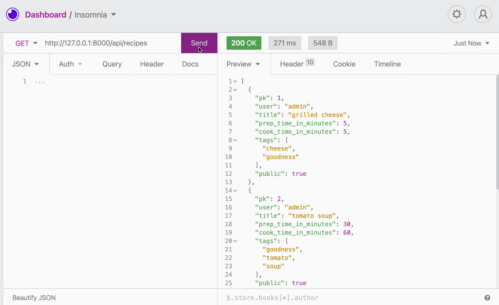

# Django Recipes

An application that lets users store and search recipes and use them to create mealplans by day.

This project was generated from the Momentum Django project template. This template sets up some minimal changes:

- [django-extensions](https://django-extensions.readthedocs.io/en/latest/) and [django-debug-toolbar](https://django-debug-toolbar.readthedocs.io/en/latest/) are both installed and set up.
- [django-environ](https://django-environ.readthedocs.io/en/latest/) is set up and the `DEBUG`, `SECRET_KEY`, and `DATABASES` settings are set by this package.
- A starting Django app named `core` is provided.
- There is a custom user model defined in `core.models.User`.
- There is a `templates/` and a `static/` directory at the top level, both of which are set up to be used.
- A `.gitignore` file is provided.
- [Pipenv](https://pipenv.pypa.io/en/latest/) is used to manage dependencies.

## Django REST Framework

### How to make a request to `POST api/recipes` in Insomnia

